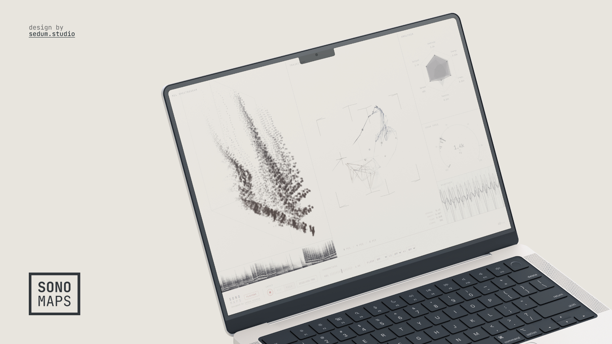

# sonomaps

SonoMaps is a browser-based audio visualization playground. I've built it for
students in my introduction to acoustics and bioacoustics courses at the
University of Oxford, but I might expand it to use more semantically interesting
embedding models if I find the time. The goal is to provide a simple,
interactive tool for exploring the structure of sound in real time.



It takes live mic input or an uploaded audio file, extracts some spectral
features in real time, then maps those features into several synchronized visual
views: mel spectrogram, trajectory cloud, radar chart, waveform, and pitch gauge.

## What it does

- Real-time analysis from microphone or local audio file.
- Mel feature extraction and derived spectral metrics.
- Streaming 3D trajectory embedding of the audio feature space.
- Coordinated visual panels for spectrogram, radar analysis, waveform, and peak frequency.
- A few adjustable runtime controls (volume, spectral floor, low/high frequency bounds).

## Stack

- SvelteKit + Svelte 5 (runes)
- TypeScript
- Vite
- Three.js (point cloud rendering)
- Web Audio API + Canvas/WebGL

## Quick start

Requirements:

- Node 20+
- pnpm

Install and run:

```bash
pnpm install
pnpm dev
```

Type-check:

```bash
pnpm check
```

Production build:

```bash
pnpm build
pnpm preview
```

## Using the app

1. Open the app in a modern desktop browser.
2. Choose input mode: MIC or FILE.
3. Press play.
4. If using MIC, allow microphone permission.
5. Tune controls as needed:
	 - VOL: input gain
	 - FLOOR: dB floor for spectral gating
	 - LO / HI: analysis band limits

Notes:

- The app runs client-side only. SSR is disabled because it depends on browser APIs.
- For mic mode, behavior can vary with browser/OS audio processing settings.

## Project layout

```text
src/
	lib/
		audio/       # Audio source setup (mic/file + analyser pipeline)
		dsp/         # Mel filterbank + feature extraction
		embedding/   # Online 'PCA' + smoothing
		render/      # Canvas/WebGL renderers
	routes/
		+page.svelte # Main app UI + orchestration loop
		+page.ts     # SSR disabled for browser APIs
```

## Scripts

- pnpm dev: run local dev server
- pnpm build: production build
- pnpm preview: preview production build
- pnpm check: Svelte sync + type checks

## Current status

This is an active prototype. The core pipeline is stable enough for experimentation, but the UX and visual language are still evolving.

If you open an issue or PR, small focused changes are easiest to review.
